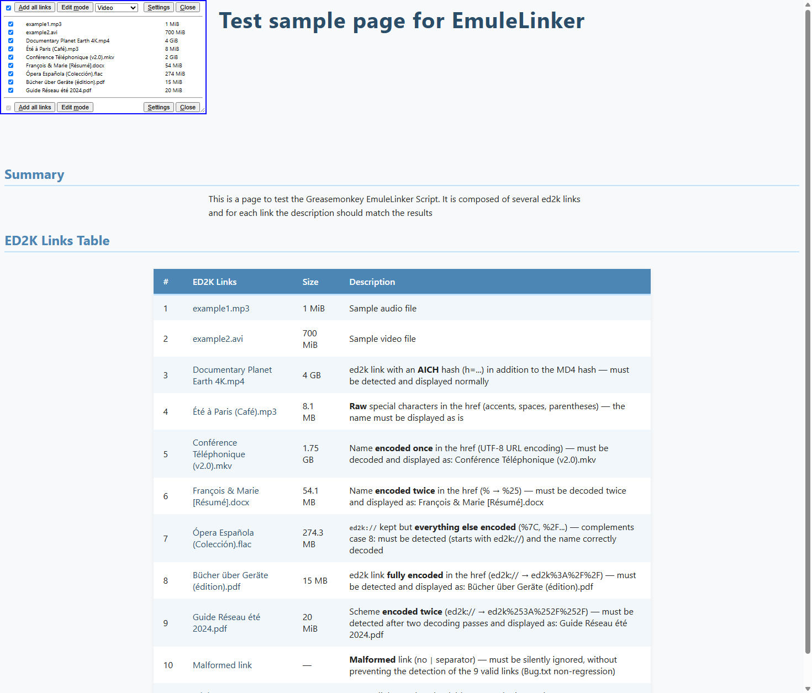
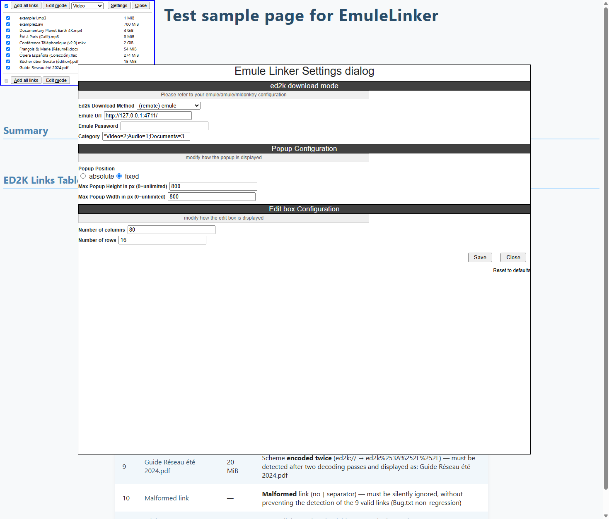

# GM_EmuleLinker

## Presentation

**GM_EmuleLinker** is a [Tampermonkey](https://tampermonkey.net/) script that adds all the [ed2k](https://en.wikipedia.org/wiki/EDonkey2000) links of a page, in one click, to [eMule](https://www.emule-project.com), [aMule](https://www.amule.org/), [MLDonkey](https://github.com/ygrek/mldonkey), or any application installed on your system that handles ed2k links.

It parses the current page and displays all the ed2k links found in a popup box, in the top left corner of the page.

Then you can add all of them in one click to your eMule, aMule or MLDonkey application.

The script provides a settings screen to match your configuration and customize the popup box.

## How to install

1. Install the [Tampermonkey](https://tampermonkey.net/) extension in your browser.

    On Chrome and the other Chromium-based browsers, Tampermonkey also needs the **Allow User Scripts** toggle, on its details page (`chrome://extensions`): without it, no script runs. See the [Tampermonkey FAQ](https://www.tampermonkey.net/faq.php).

    This script was originally developed for [Greasemonkey](https://www.greasespot.net/), but Tampermonkey is now recommended. [Violentmonkey](https://violentmonkey.github.io/) may work too, but it is not tested.

2. To send the links to eMule, aMule or MLDonkey, enable the web server of this application, even when it runs on the same computer. Only the method named **your system default** (step 5) works without it.
    1. In eMule, go to Options → Web Interface → \[x\] Enabled
        - set a port number (4711 is the default)
        - and, optionally, a password
    2. If you use aMule or MLDonkey, see the documentation of its web interface.

3. Install the script: open [GM_EmuleLinker.user.js](https://raw.githubusercontent.com/alo0/GM_EmuleLinker/master/GM_EmuleLinker.user.js). Tampermonkey shows its installation page: click **Install**.

    Installed before version 0.10? Nothing to do: Tampermonkey moves your installation to this new file at its next update check, and keeps your settings.

4. Open a page with ed2k links: the settings dialog opens by itself the first time.

    To try the script, download the [test sample page](https://raw.githubusercontent.com/alo0/GM_EmuleLinker/master/test_sample.html) (Save As) and open it from your disk. On Chrome, Tampermonkey runs on local files only with the **Allow access to file URLs** toggle of its details page.

    Later, the **Settings** button of the popup, or `Ctrl+Alt+S`, opens the dialog again. Hover over the labels for more explanations.

5. Set your configuration. Choose one of the **Ed2k Download Method** values:
    - **your system default** uses the application installed on your computer that handles ed2k links by default
    - **(remote) emule**, **(remote) amule** or **(remote) mldonkey** sends the links to the web server of this application, local or remote
    - **custom (experimental)** sends the ed2k links to your own web server, so that you can process them as you see fit

    Then fill in the following fields:
    - **Emule Url**, in the form `http://ip:port/`
    - **Emule Password**, if your web server has one (eMule and aMule only)
    - **Category**, if you want to choose the category of the downloads, in the form `*label1=value1;label2=value2;...`. The label prefixed by a `*` is the default choice.
        - eMule: `default=0;*Audio=1`, the value is the number of the category tab in eMule. `Audio` is the default choice here.
        - aMule: `*Audio=audio;Video=Video`, aMule uses the name of the category instead of a number.
        - MLDonkey and your system default: categories are not supported.

    Don't forget to **Save** before closing the dialog.

6. You can now add all the links of a page to your eMule, aMule or MLDonkey application.

7. (optional) The script is active on every page you visit. To restrict it, add **User includes** in the settings of the script in the Tampermonkey dashboard, rather than modifying its `@include` line: a modified script is overwritten by the next update. See the [Tampermonkey FAQ](https://www.tampermonkey.net/faq.php#Q103).

## Usage

The popup lists the files of the page, with their size, each with a checkbox.

- **Add all links** sends the checked links. Clicking a file name sends this link only.
- The drop-down list chooses the category of the downloads (eMule and aMule). The choice applies to the current page only: each new page starts on the default category of the settings.
- **Edit mode** replaces the list by a text box holding the links, which you can edit: its content is what is sent. **Normal mode** goes back to the list.
- A popup closed on a page stays closed on the next pages, until you open it again. The links can still be sent while it is closed.

All the commands are also available in the Tampermonkey menu, under **Emule Linker**, and through keyboard shortcuts:

| Shortcut | Action |
|---|---|
| `Ctrl+Alt+A` | Add the links (all the links of the page when the popup is closed) |
| `Ctrl+Alt+M` | Switch between normal mode and edit mode |
| `Ctrl+Alt+O` | Open the popup |
| `Ctrl+Alt+C` | Close the popup |
| `Ctrl+Alt+X` | Open or close the popup |
| `Ctrl+Alt+S` | Open the settings dialog |

## Support

Compatibility of each **Ed2k Download Method**, with Tampermonkey (recommended), on the latest stable version of the browsers:

| Browser | your system default | (remote) emule | (remote) amule | (remote) mldonkey |
|---|---|---|---|---|
| Chrome | Partial ¹ | Full | Partial ² | Not tested |
| **Firefox** (recommended) | Full | Full | Partial ² | Not tested |

¹ One link per user action: click the file names one by one, or enable the web server of eMule, even on your own computer, and use the **(remote) emule** method with `http://127.0.0.1:4711/` to send all the links at once.

² aMule 2.x only: the newest aMule versions (3.x) are not supported.

eMule is tested both on the same computer and on a remote one, aMule on a remote one only.

To report a problem, switch the debug traces on with the Tampermonkey menu entry **Emule Linker: Toggle debug traces**, reload the page, and attach what the browser console shows (F12). The same menu entry switches them off.

## Limitations

Modern browsers don't like scripts that silently open windows or change the focus of the browser, even when one of your actions initiates it: it is considered bad behavior and a security risk. I tried several methods to improve the way this script sends the links to eMule, aMule or MLDonkey, but only the old way implemented here does not require complex user interactions or browser- or server-specific settings.

The script sends a GET request in a new window. All the arguments are passed in the URL, including the password. Therefore, I strongly recommend accessing your eMule, aMule or MLDonkey through HTTPS, which hides this information from people on the same network. Note that the whole URLs, links and passwords included, stay visible in your browser history.

Another limitation of a GET request is the number of characters that can be passed through. The limit depends on several factors, such as the browser, the proxies and the remote application. If you send a lot of ed2k links at once and the remote application seems to ignore them, you might have reached the limit. As a workaround, send the links in several batches.

None of these comments apply to the method named **your system default**, which has its own limit on Chrome (see [Support](#support)).

## Running the tests

An automated test suite runs the script in a real headless Chrome. It needs Chrome and Python 3 (standard library only, nothing to install):

    python tests/run_tests.py

Tampermonkey is not needed: the script is injected unchanged into the test pages, and fake eMule, aMule and MLDonkey web interfaces receive what it sends. Set the `CHROME_PATH` environment variable if Chrome is not found automatically. In VS Code, the tests also appear in the Testing panel (Python extension, unittest).

Before a release, a live test can also check the real eMule, its web server enabled: it adds three test files, finds them in the eMule transfer list, then cancels them. The web password is read from the `EMULE_PASSWORD` environment variable:

    python tests/run_tests.py --live-emule

See [SPECIFICATIONS.md](SPECIFICATIONS.md#82-automated-test-suite) for what is covered, and for the manual checks to do before a release.

## License

GM_EmuleLinker is distributed under the GNU General Public License v3 ([LICENSE](LICENSE)). It embeds the GM_config library, distributed under the GNU Lesser General Public License.

The changes of each version are listed in the CHANGELOG, at the top of [GM_EmuleLinker.user.js](GM_EmuleLinker.user.js).
